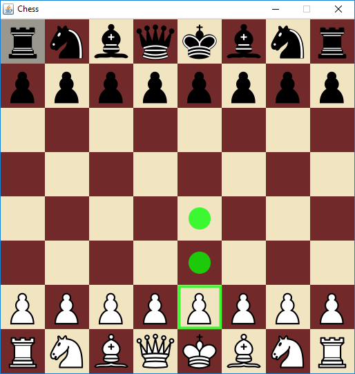
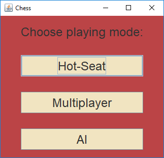
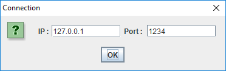

# Chess
Chess is strategy board game played on a checkered board with 64 squares arranged in an 8x8 grid

White is starting game.
Each piece has its own way of moving. Clicking the left mouse button shows the available movements.
Game ends on draw or checkmate.
    
   

## GUI

The game interface is made in Java Swing

## Game modes
Game has 3 modes

### HotSeat
HotSeat is similar to normal chess, in this mode two players can try who is better

### Multiplayer

Multiplayer is mode for two players on different devices. Both devices must be in same network. 
For this mode check your firewall configuration.

### AI
AI is a single player mode in which we will face an opponent. Artificial intelligence is using Minimax algorithm, a recursive algorithm for choosing the next move in an n-player game. A value is associated with each position or state of the game. This value is computed by means of a position evaluation function and it indicates how good it would be for a player to reach that position. The player then makes the move that maximizes the minimum value of the position resulting from the opponent's possible following moves. If it is A's turn to move, A gives a value to each of their legal moves.

## About
This game was made by 2 students, as a team project.

* Michal Sliwa (Forestf90)
* Krzysztof Heller
